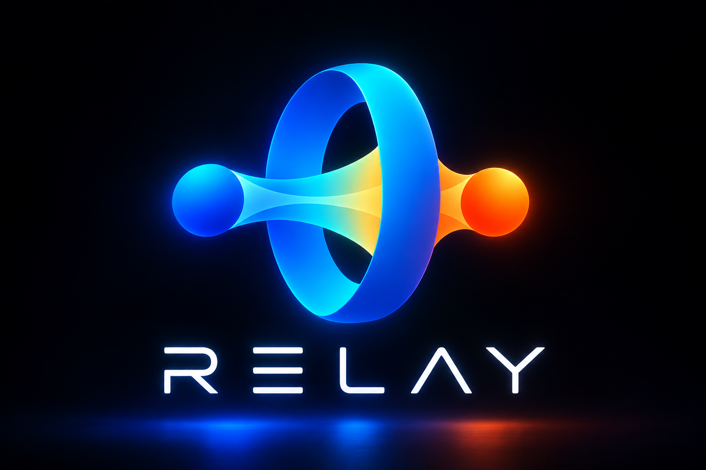

# Relay

<picture>
  <source media="(prefers-color-scheme: dark)" srcset="docs/branding/relay-banner-dark.png">
  <source media="(prefers-color-scheme: light)" srcset="docs/branding/relay-banner-light.png">
  
</picture>

Relay is a personal finance project based on [Sure](https://github.com/we-promise/sure),
with roots in [Maybe](https://github.com/maybe-finance/maybe). It preserves the
original Git history and builds on my personal fork, with a focus on accurate
data, planning, forecasts, and reports. Upstream changes are adopted selectively.

This is a personal project, developed for my own needs, without affiliation with
the Sure or Maybe teams.

- [Product scope: what Relay keeps and what was retired](docs/product-scope.md)
- [Installation on TrueNAS](docs/hosting/truenas.md) or [generic Docker](docs/hosting/docker.md)
- [Clients and API](docs/clients.md)
- [Development guides](docs/llm-guides/README.md)
- [Local Docker setup](docs/llm-guides/docker-local-app.md) and [tests](docs/llm-guides/docker-tests.md)
- [Relay migration](RELAY_MIGRATION.md) and [pruning plan](docs/migration/pruning-plan.md)
- [Historical Sure documents and release workflows](docs/archive/sure/README.md)

Licensed under [AGPLv3](LICENSE). Original history and attributions are retained.
