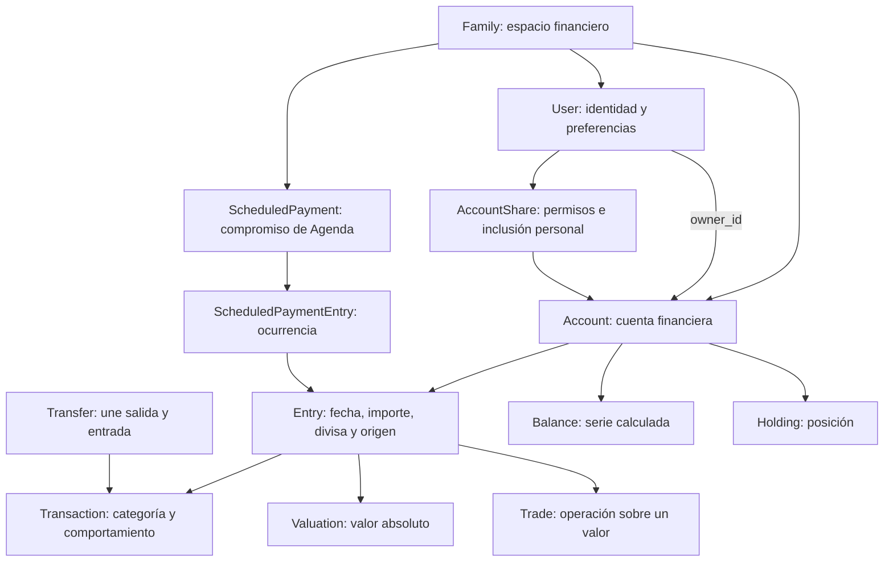

# Investigación: simplificar cuentas, movimientos y relaciones financieras

Fecha: 6 de octubre de 2026. Referencia analizada: `bf0580f62076a22eea578916e26d7180eb463781`, en `main`, después de la poda y del refinado de fase 12.

**Estado: investigación y propuestas; ninguna implementación aprobada por este documento.**

## 1. Conclusión para decidir

Sí merece la pena una segunda etapa de simplificación. La poda redujo las funcionalidades que rodeaban las finanzas; ahora podemos reducir las reglas duplicadas y los significados mezclados dentro del núcleo. La mejora más valiosa sería que cada dato tenga un significado claro y que cada operación tenga un recorrido reconocible.

Recomiendo una refactorización gradual que conserve resultados financieros, permisos y contratos. No recomiendo empezar eliminando familias, fusionando todas las tablas financieras o sustituyendo el sistema por un libro contable nuevo. Son cambios costosos que no atacan primero los problemas observados.

Las prioridades son:

1. Acordar y documentar una matriz de efectos: qué cuenta para saldo, patrimonio, informes, presupuesto y previsión.
2. Separar tipo de movimiento, comportamiento de previsión y protección de datos importados.
3. Concentrar las operaciones de transferencias y las reglas compartidas de Agenda/previsión.
4. Separar descripción comercial de una inversión, tratamiento fiscal y modo de seguimiento.
5. Reducir la infraestructura genérica de proveedores a lo que utiliza Enable Banking, preservando la recuperación histórica.
6. Revisar integridad, invalidación de cachés y costes de consulta con evidencia medida.

**Menos campos no siempre significa menos complejidad.** Separar dos conceptos que hoy comparten un campo puede introducir una columna y aun así reducir mucho el número de excepciones. El criterio debe ser cuántas reglas hay que comprender para desarrollar una función y cuántos lugares hay que cambiar.

## 2. Alcance y límites de la investigación

Se han revisado modelos, concerns, esquema, consumidores de informes y previsiones, importación, permisos, formularios, contratos de backup y pruebas relevantes. Se consultaron documentación oficial de Rails y PostgreSQL para contrastar las opciones técnicas.

El árbol estaba limpio al empezar. Se actualizó la referencia `origin/main` y se comprobó que coincide con `main`. Solo se crea este documento. No se han ejecutado Rails, tests, migraciones, servidor, consultas sobre la instalación ni modificaciones de datos. No hay commit ni push.

Distinción de evidencia:

- **Observado:** comportamiento o estructura legible en el código de esta referencia.
- **Propuesta:** diseño recomendado, sujeto a selección del usuario.
- **Pendiente de comprobar:** incidencia, ahorro o distribución de datos que requiere pruebas o un inventario real.

No se conocen las frecuencias reales de subtipos, flags, cuentas compartidas o metadatos históricos en la instalación. Tampoco se han medido tiempos, memoria, consultas ni planes SQL. Los riesgos identificados no equivalen a errores reproducidos en producción.

Algunas guías arrastran descripciones anteriores a la poda. Por ejemplo, la guía de arquitectura todavía menciona persistencia comercial y valoraciones externas en apartados antiguos; la de Goals describe referencias a Plaid/SimpleFIN y limitaciones que el modelo actual ya aborda con asignaciones. Para esta investigación prevalecen el código y el esquema actuales. Corregir esas guías sería una entrega posterior de documentación.

## 3. Qué relaciones existen realmente

### 3.1. Usuario y familia

Sí existe un usuario individual: `User` gestiona identidad, sesiones, credenciales, preferencias y propiedad de cuentas. `Family` es el contenedor financiero y el límite de aislamiento. Una familia puede tener un solo usuario; usar la aplicación individualmente no exige sustituirla por cuentas directamente colgadas de un usuario.

El diagrama resume relaciones; una `Entry` delega en **uno** de Transaction, Valuation o Trade. Una transferencia referencia dos Transaction, cada una con su Entry; sus comisiones son transacciones adicionales.

Hay tres preguntas distintas:

| Pregunta | Autoridad actual | Por qué no conviene mezclarlas |
| --- | --- | --- |
| ¿A qué espacio pertenecen los datos? | `family_id` | Aislamiento, categorías, importación y backup |
| ¿Quién puede ver o modificar una cuenta? | Propietario y `AccountShare.permission` | Permiso de acceso |
| ¿Qué cuentas forman las finanzas de una persona? | Propiedad y `AccountShare.include_in_finances` | Una cuenta visible no tiene por qué sumarse a sus finanzas |

`Current.accessible_accounts` y `Current.finance_accounts` ya reconocen esa diferencia. `User#accessible_accounts` parte de `family.accounts.accessible_by(self)` y `User#finance_accounts` de `included_in_finances_for(self)`.

**Recomendación:** conservar la familia como espacio financiero y mejorar su explicación en producto/documentación. No cambiar la tabla por razones de terminología. Concentrar la selección de cuentas para cada finalidad y exigir primero el ámbito familiar y de acceso. Si más adelante se quiere un producto estrictamente monopersonal, es una decisión de producto que afecta también a invitaciones, permisos, informes compartidos, Drive y backups.

Fuentes: [Family](../../app/models/family.rb), [User](../../app/models/user.rb), [Current](../../app/models/current.rb), [AccountShare](../../app/models/account_share.rb).

### 3.2. Cuenta y tipos especializados

`Account` contiene pertenencia, propietario, divisa, saldo, visibilidad y tratamiento financiero. Delega detalles en nueve tipos: Depository, Investment, Crypto, Property, Vehicle, OtherAsset, CreditCard, Loan y OtherLiability. `classification` se genera en la base según el tipo.

No todos los tipos son variantes cosméticas. Préstamos, inmuebles e inversiones tienen datos y cálculos distintos. Aplanarlos todos en `accounts` generaría columnas opcionales y nuevas validaciones condicionales. Sustituirlos por un JSON genérico debilitaría claridad e integridad.

**Recomendación:** mantener inicialmente `delegated_type`. Reducir los puntos en que consumidores preguntan directamente por tipo/subtipo, utilizando capacidades concretas ya próximas al modelo (`supports_trades?`, `balance_type`, etc.). No crear una plataforma genérica de capacidades; usar pocas decisiones financieras explícitas.

Rails documenta los tipos delegados como una forma de compartir atributos comunes manteniendo tablas para los atributos específicos. Eso respalda conservar esta estructura mientras no haya evidencia de que su coste domina el mantenimiento. [Documentación oficial de asociaciones](https://guides.rubyonrails.org/association_basics.html#delegated-types).

Fuentes: [Account](../../app/models/account.rb), [Accountable](../../app/models/concerns/accountable.rb), [esquema](../../db/schema.rb).

### 3.3. Entry, Transaction y datos calculados

`Entry` representa el registro común: cuenta, fecha, importe, divisa, nombre, origen, conciliación y protección. `Transaction` añade categoría, comercio, etiquetas, tipo y comportamiento de previsión. `Valuation` registra un valor absoluto; `Trade`, cantidad/precio y operación bursátil. Una valoración de 10.000 no equivale a un ingreso de 10.000.

`Balance` y parte de `Holding` son proyecciones/materializaciones. También hay posiciones autoritativas importadas, anclas y observaciones históricas que constituyen evidencia financiera. No se puede tratar toda esa persistencia como una caché descartable.

**Recomendación:** mantener las entidades; hacer explícito qué es dato de entrada, evidencia importada y resultado recalculable. No convertir todo a Transaction ni implantar event sourcing o contabilidad de doble partida como primera medida.

Fuentes: [Entry](../../app/models/entry.rb), [Recalculator](../../app/models/account/recalculator.rb), [Materializer](../../app/models/balance/materializer.rb), [CurrentBalanceManager](../../app/models/account/current_balance_manager.rb), [política de backups](../../app/models/family/backup/discard_policy.rb).

## 4. Flags y reglas: el principal foco de simplificación

### 4.1. Una cuenta tiene varios ejes legítimos

| Eje | Representación actual | Significado |
| --- | --- | --- |
| Ciclo de vida | `status`: active, draft, disabled, pending_deletion | Disponibilidad y retirada de la cuenta |
| Presentación | `archived` | Ocultación en navegación; no equivale a exclusión financiera |
| Tratamiento global | `exclude_from_reports` + `cashflow_boundary` | Incluida, seguimiento o fuera de finanzas |
| Participación personal | `AccountShare.include_in_finances` | Inclusión para un usuario concreto |
| Conexión | Existencia de `account_providers` | Cuenta con conexión vigente o manual |
| Historia de saldos | `reverse_balance_history` más conexión | Estrategia de cálculo, incluso después de desconectar |
| Inversión gestionada | Flag `managed_portfolio` y determinados subtipos | Uso de cartera gestionada y restricciones de operaciones |

Estos ejes responden a preguntas diferentes. No recomiendo sustituirlos por un único estado enorme que enumere todas sus combinaciones.

Sí recomiendo hacer canónico `financial_treatment`, que hoy es un atributo virtual derivado de dos booleanos:

| Tratamiento | `exclude_from_reports` | `cashflow_boundary` |
| --- | --- | --- |
| included | false | false |
| tracking | true | false |
| outside_finances | true | true |

La combinación false/true ya está prohibida por validación y CHECK. Una columna de tres valores podría expresar lo mismo con menos interpretación. Primero hay que mover los lectores a predicados comunes; después, si sigue compensando, migrar la persistencia y el formato de backup. Este cambio es mantenibilidad, no una promesa de rendimiento.

**Ejemplo que debemos preservar:** enviar 100 € a una cuenta de seguimiento sigue siendo movimiento dentro de la frontera; enviar 100 € a una cuenta fuera de finanzas se clasifica como gasto al cruzarla. Archivar la cuenta solo cambia presentación.

Fuentes: `Account#financial_treatment`, scopes y `reclassify_boundary_transfers`; [Transfer](../../app/models/transfer.rb); pruebas en [transfer_test](../../test/models/transfer_test.rb).

### 4.2. «Excluido» tiene varias responsabilidades

Observado:

- Informes y previsiones filtran `entries.excluded = false`.
- `Balance::SyncCache` excluye pendientes y padres de divisiones, pero **no aplica un filtro general por `excluded`**. Un gasto excluido del informe puede seguir afectando al saldo.
- `Entry#protected_from_sync?` considera protegido un registro excluido.
- `Entry#split!` marca el padre como excluido; además existen filtros específicos para padres divididos.
- La limpieza de pendientes antiguos utiliza también `excluded`.

No es correcto describir este campo como «el movimiento no existe económicamente». Hoy combina una decisión de analítica, una protección de importación y un detalle estructural.

**Propuesta:** definir una política de elegibilidad por finalidad, con nombres que expresen efectos: saldo, informe, historial de previsión, matching. Mantener separados pendientes y padres de divisiones. Decidir después si hace falta un motivo de exclusión y separar la protección de sincronización. No añadir cinco booleanos configurables por el usuario: la mayoría de esos efectos deben derivarse de reglas comunes.

Caso de control: una compra extraordinaria de 1.000 € debe reducir el saldo aunque se quite del cálculo de gasto recurrente. Una división 60/40 debe contar 100, nunca 200, incluso si una parte se excluye de informes. Cambiar la exclusión analítica no debería permitir que el proveedor sobrescriba datos manuales sin una decisión explícita.

Fuentes: [SyncCache](../../app/models/balance/sync_cache.rb), `Entry#split!`, `protected_from_sync?`, `auto_exclude_stale_pending`, [Forecast](../../app/models/scheduled_payment/forecast.rb).

### 4.3. Tipo de movimiento y previsión están acoplados

`Transaction.kind` mezcla naturaleza financiera (transferencia, pago de préstamo) con `one_time`, que describe si algo debe repetirse en estimaciones. Existe además `forecast_behavior` con normal, exceptional_once e irregular_recurring.

El callback `synchronize_legacy_one_time_behavior` sincroniza ambos campos. Al guardar un comportamiento excepcional puede escribir `kind = one_time`; al salir de ese comportamiento puede volver a standard. Eso obliga a razonar sobre dos autoridades para una misma idea y sobre su convivencia con transferencias.

**Recomendación de alta prioridad:** usar `kind` exclusivamente para naturaleza del movimiento y `forecast_behavior` para su tratamiento estadístico. Mantener un adaptador de lectura/importación para `one_time` histórico durante la transición. Antes de retirar el valor, caracterizar sus efectos actuales sobre presupuestos: `one_time` pertenece a `BUDGET_EXCLUDED_KINDS`, por lo que desacoplar campos sin esa comprobación cambiaría cifras.

Hay también una discrepancia documental interna: comentarios dicen que investment_contribution cuenta como gasto en presupuesto, pero la lista ejecutable `BUDGET_EXCLUDED_KINDS` lo excluye. No se debe «corregir» la lista siguiendo el comentario. Hace falta acordar una matriz y verificar consumidores y pruebas.

Fuentes: [Transaction](../../app/models/transaction.rb), [ScopedTransactionsQuery](../../app/models/income_statement/scoped_transactions_query.rb), [Totals](../../app/models/income_statement/totals.rb), [forecast_test](../../test/models/scheduled_payment/forecast_test.rb).

## 5. Transferencias y emparejamiento

### 5.1. El modelo de dos movimientos tiene valor

Una transferencia conserva un movimiento en cada cuenta. Las fechas pueden diferir y las divisas/importes también. Es útil para importar extractos reales, reflejar ambos saldos y distinguir movimientos internos, pagos de tarjeta, préstamos, aportaciones y cruces de frontera.

Recomiendo conservarlo. Una sola fila con cuenta origen/destino parecería más simple, pero trasladaría la dificultad a saldos, importación, fechas y conciliación.

El margen está en **concentrar el ciclo de vida**: creación manual en `Transfer::Creator`, creación en Agenda, autoemparejamiento, confirmación/rechazo, eliminación, cambio de categorías y reclasificación por frontera. Hay reglas comunes distribuidas entre Transfer, Transaction::Transferable, Family::AutoTransferMatchable, Account y ScheduledPaymentEntry.

Propuesta: una operación de dominio para enlazar dos movimientos existentes, utilizada por matching manual/automático y Agenda cuando proceda, y operaciones explícitas para crear/desenlazar. Separar efectos de base de datos, validación de permisos y programación de recálculos. La creación manual puede construir los movimientos y reutilizar el enlace. Evitar una clase universal que concentre todas las finanzas.

### 5.2. Riesgos concretos que conviene caracterizar

1. **Unicidad:** el modelo valida unicidad de cada extremo; el esquema tiene una pareja única y dos índices individuales no únicos. La pareja única no garantiza por sí sola que una salida no se empareje con dos entradas diferentes. Proponer índices únicos por extremo tras inventariar datos y pruebas de carreras. Una restricción adicional entre roles, si se exige, necesitaría otro diseño; dos índices separados no la resuelven por sí solos.
2. **Relaciones con nombres ambiguos:** `Transaction` declara `belongs_to :transfer` para comisiones, pero el concern define `transfer` como la transferencia de la que es extremo. No debe suponerse que los dos significados funcionan igual. Proponer nombres explícitos para transferencia emparejada y transferencia a la que pertenece una comisión, con pruebas de lectura, borrado y serialización.
3. **Importe duplicado:** `transfers.amount` existe, mientras métodos de presentación derivan importes de los extremos. Conservar importes por divisa y decidir qué representa el campo almacenado; no borrar antes de revisar API, creador y backups. `total_fee` suma comisiones de ambas cuentas sin devolver un Money por divisa: revisar su contrato para transferencias multimoneda antes de usarlo como total económico.
4. **Cambios posteriores:** se reclasifica al cambiar la frontera de la cuenta, pero hay otros cambios de tipo, fecha, importe y comportamiento que requieren una política coherente. No se afirma que todos estén fallando; deben incluirse en las pruebas de caracterización.

Fuentes: [Transfer](../../app/models/transfer.rb), [Transferable](../../app/models/transaction/transferable.rb), [Creator](../../app/models/transfer/creator.rb), [ScheduledPaymentEntry](../../app/models/scheduled_payment_entry.rb), [esquema](../../db/schema.rb).

### 5.3. Hay varios «emparejadores» diferentes

| Emparejamiento | Lo que decide | Qué debe conservar |
| --- | --- | --- |
| Transferencia | Dos movimientos en cuentas distintas son una operación | Frontera, divisas, permisos, rechazo y concurrencia |
| Pendiente/contabilizado | Dos registros representan la misma compra | Origen, identidad externa y cambios manuales |
| CSV/manual/proveedor | Un registro ya existe y el banco puede reconocerlo | Idempotencia sin crear ni apropiarse de duplicados ambiguos |
| Agenda/histórico | Una transacción corresponde a un compromiso | Una ocurrencia no se contabiliza dos veces |
| GoalPledge | Un movimiento o valoración satisface una intención | Una evidencia no se reclama dos veces |
| Categorización | Asignación de categoría por reglas/Bayes | Preferencias y bloqueos manuales |

No recomiendo fusionarlos en un «matcher» genérico. Comparten mecanismos pequeños, pero deciden cosas diferentes.

El autoemparejador de transferencias prioriza misma moneda e importe exacto, después FX con tolerancia; usa cuatro días, mientras el diálogo manual y transferencias confirmadas permiten treinta. FX automático requiere cuentas conectadas; el manual permite cuentas manuales. Recuerda parejas rechazadas. El algoritmo consume candidatos de forma voraz, y el orden final solo explicita rango y diferencia de fechas.

Propuesta: separar búsqueda de candidatos, decisión y escritura. Añadir desempates deterministas. Evaluar que parejas con varias alternativas igualmente plausibles se presenten para revisión en lugar de aplicarse automáticamente. **Esto cambia comportamiento de producto**, aunque mejore confianza; requiere selección expresa. No simplificar quitando rechazos, multimoneda o protección contra concurrencia.

El SQL actual ya tiene un índice parcial de búsqueda en entries por moneda, importe, fecha y cuenta. No recomendar otro índice o reescribir toda la consulta sin `EXPLAIN` y datos representativos.

Fuentes: [AutoTransferMatchable](../../app/models/family/auto_transfer_matchable.rb), [pruebas](../../test/models/family/auto_transfer_matchable_test.rb), [ProviderImportAdapter](../../app/models/account/provider_import_adapter.rb), [ScheduledPayment](../../app/models/scheduled_payment.rb).

## 6. Inversiones y configuración de cuentas

El catálogo `Investment::SUBTYPES` mezcla productos comerciales de muchos países, tratamiento fiscal y decisiones de seguimiento. Reducir el desplegable es razonable, pero no equivale a poder borrar sus valores sin consecuencias.

Dos efectos observados son especialmente importantes:

- `Investment#tax_treatment` se deriva del subtipo. `Family#tax_advantaged_account_ids` utiliza ese catálogo para excluir cuentas de determinados cálculos de presupuesto/cashflow.
- Cambiar a roboadvisor o managed_fund activa `migrate_trades_to_transactions`: convierte Trades en Transactions y elimina la entidad Trade con sus métricas de ticker/precio/cantidad. Por tanto, un cambio de selector puede ser una transformación de datos, no una etiqueta.

`Account#managed_portfolio?` reconoce tanto subtipos como un flag preservado de cuentas históricas. Esto demuestra que «producto fiscal» y «cartera gestionada» ya son conceptos separados, aunque su representación todavía los mezcle.

**Propuesta recomendada:**

1. Catálogo visible corto para nuevas cuentas, conservando la visualización y lectura de valores existentes. El usuario debe elegir la lista; candidatos: cartera con operaciones, cartera gestionada/roboadvisor, pensión y otra inversión.
2. Modo de seguimiento explícito: operaciones/posiciones o valor global/cartera gestionada. No inferir toda la mecánica a partir del nombre comercial.
3. Tratamiento fiscal separado, con migración que preserve la clasificación actual. El significado de fiscalidad en informes debe acordarse; este documento no determina reglas tributarias.
4. Ninguna conversión destructiva en un guardado ordinario de subtipo. Una conversión debe ser una operación propia, con previsualización de efectos y recuperación definida.

No añadir una nueva configuración si puede derivarse de una autoridad ya existente. En particular, decidir si el flag managed_portfolio se convierte en el modo canónico o si necesita sustitución; evitar una tercera representación.

Otros candidatos a limpieza:

| Elemento | Evidencia | Recomendación |
| --- | --- | --- |
| `enable_category_matcher` | Lista de proveedores compatibles vacía; el formulario lo condiciona, el controlador aún lo permite | Candidato a retirar tras auditoría de consumidores y backup; no confundirlo con reglas/Bayes activos |
| `accounts.subtype` | Columna física más lector/escritor delegado al accountable | Auditar diferencias y serialización; decidir una única autoridad antes de eliminar la columna |
| `account_providers_count` | Columna y ajustes de recuperación, pese a decisiones que consultan la asociación | Determinar si sirve como contador mantenido, contrato o residuo; no asumir equivalencia con `linked?` |
| Estados draft/disabled | Tienen scopes, sincronización y eliminación específicos | Mantener hasta comprobar flujos activos y datos; archived no los sustituye |
| Moneda, anclas y estrategia reverse | Cambian cálculos financieros | Conservar como invariantes técnicas, con menos exposición al usuario |

Fuentes: [Investment](../../app/models/investment.rb), [TaxTreatable](../../app/models/concerns/tax_treatable.rb), `Account#managed_portfolio?`, `Family#tax_advantaged_account_ids`, [formulario](../../app/views/accounts/_form.html.erb), [AccountableResource](../../app/controllers/concerns/accountable_resource.rb), [investment_test](../../test/models/investment_test.rb).

## 7. Previsiones y Agenda

Hay dos modelos de previsión: `ScheduledPayment::Forecast` para una cuenta y `WealthForecast` para patrimonio. Es razonable que difieran: mover dinero entre dos cuentas cambia la liquidez de una, pero no necesariamente el patrimonio conjunto; las inversiones añaden rendimiento.

Lo que conviene compartir son las reglas sobre entradas históricas, explicación por Agenda, comportamiento excepcional/irregular y construcción de eventos.

Observado:

- Ambos filtran pendientes, exclusión y padres divididos.
- Ambos intentan explicar históricos por título, sentido, importe con tolerancia y ocurrencia cercana.
- La previsión patrimonial comprueba además igualdad de moneda en esa explicación; la de cuenta no contiene esa comprobación en el mismo método.
- La previsión por cuenta excluye por `kind = one_time`; la patrimonial utiliza `forecast_behavior` para excepcionales. Esa diferencia queda disimulada por el callback de sincronización.
- Los horizontes y estimadores tienen parte compartida, pero no idénticas ventanas históricas ni interpretación de transferencias.

**Propuesta:** extraer primero una política de explicación de Agenda y otra de selección histórica. Un enlace confirmado con ScheduledPaymentEntry debe tener prioridad sobre una coincidencia heurística. Las heurísticas deben declarar por qué explican un registro y evitar doble aplicación. Compartir eventos pequeños con importe/divisa/fecha/origen; mantener los dos modelos matemáticos separados.

La diferencia de moneda y la precedencia excepcional/irregular/Agenda son candidatos a pruebas, no errores demostrados en esta investigación. No unificar ventanas, rendimientos ni reglas de liquidez solo para eliminar líneas.

Fuentes: [Forecast](../../app/models/scheduled_payment/forecast.rb), [WealthForecast](../../app/models/scheduled_payment/wealth_forecast.rb), [RobustEstimator](../../app/models/scheduled_payment/robust_estimator.rb), [ForecastBacktest](../../app/models/scheduled_payment/forecast_backtest.rb).

## 8. Importación, saldos y responsabilidades de escritura

### 8.1. Menos proveedores permite menos infraestructura

Enable Banking solo declara soporte de Depository/CreditCard. Aun así, Provider::Factory conserva descubrimiento dinámico de adapters, registro y APIs para múltiples proveedores; AccountProvider es polimórfico y Linkable maneja listas de proveedores. ProviderImportAdapter contiene operaciones de posiciones/trades y ramas documentadas para proveedores retirados.

**Recomendación:** auditar consumidores fuera de tests, generadores y recuperación, y simplificar la factoría a registro explícito de Enable Banking. Mantener la frontera de normalización financiera que sí se usa. Evaluar después una asociación tipada con FK en lugar de la polimórfica; beneficio de integridad medio, migración de coste medio/alto, no primera prioridad.

No borrar import_holding/import_trade únicamente porque no exista un conector de inversión: hay contratos, generadores y pruebas, y deben buscarse imports/API/consumidores indirectos. Tampoco reducir `PENDING_PROVIDERS` a Enable Banking sin normalizar primero los flags de transacciones históricas: los conectores desaparecieron, pero sus metadatos pueden sobrevivir en movimientos y backups.

Una normalización posible es un estado pending/posted independiente del proveedor, manteniendo el payload original para procedencia. Debe haber lector compatible para backups antiguos y verificación de flags discrepantes, no un cambio de la lista que reclasifique silenciosamente datos.

### 8.2. Recálculo e importación son operaciones distintas

La poda ya creó una base buena: Account::Recalculator recalcula localmente dentro de una transacción. Se conservan cálculo forward y reverse, anclas y datos importados. Account::Syncer y Family::Syncer todavía utilizan «sync» para trabajos locales y externos.

Recomiendo hacer explícitos los recorridos de importar, modificar, conciliar y recalcular. Unificar cómo se calcula la fecha mínima afectada, se marcan cambios manuales, se invalidan proyecciones y se encola el recálculo después del commit. No migrar todas las clases/colas solo para renombrar: los nombres serializados tienen contratos y costes.

Hay protección por registro (`user_modified`, `import_locked`, `excluded`) y por atributo (`locked_attributes`). El adaptador ya tiene excepciones para refrescar metadatos bancarios sin sobrescribir cambios humanos. Antes de reemplazarlo por protección solo por campo, formalizar qué campos pertenecen al banco y cuáles al usuario, incluyendo pendiente→contabilizado, nombre, fecha y FX. Es una refactorización valiosa, pero de riesgo alto si cambia precedencias.

La edición de saldo tiene además estrategias distintas: para ciertas cuentas de efectivo sin conciliaciones ajusta el saldo inicial; en otros casos crea una conciliación. Conservar el resultado actual primero y documentar esa intención. Cambiar a «toda edición de saldo crea una valoración hoy» modificaría la historia.

La documentación de Rails distingue callbacks dentro de la transacción de efectos posteriores a la confirmación. La propuesta es mantener cambios financieros atómicos y llevar programación de trabajos/efectos externos al momento adecuado, con pruebas de rollback. [Callbacks de Active Record](https://guides.rubyonrails.org/active_record_callbacks.html).

Fuentes: [Factory](../../app/models/provider/factory.rb), [EnableBankingAdapter](../../app/models/provider/enable_banking_adapter.rb), [Linkable](../../app/models/account/linkable.rb), [ProviderImportAdapter](../../app/models/account/provider_import_adapter.rb), [Recalculator](../../app/models/account/recalculator.rb), [CurrentBalanceManager](../../app/models/account/current_balance_manager.rb).

## 9. Integridad de datos, multimoneda y cachés

### 9.1. Reforzar lo importante en la base

El esquema ya contiene restricciones útiles: frontera financiera válida, permisos de compartición, claves externas, identidad de imports y claves idempotentes. Conviene revisar los huecos antes de añadir nuevos sistemas.

| Invariante a auditar | Situación observada | Vía posible |
| --- | --- | --- |
| Un extremo solo pertenece a una transferencia en su rol | Validación Ruby; índices individuales no únicos | Índices únicos después de verificar duplicados |
| Una Entry corresponde a un único entryable y este existe | Asociación delegada; sin FK polimórfica ni índice único del par en esquema revisado | Inventario de huérfanos/duplicados; unicidad del par si el contrato lo exige |
| Propietario y usuarios compartidos pertenecen a la familia de la cuenta | Validaciones de modelo; FKs individuales | Evaluar FKs compuestas solo donde compense; conservar operaciones transaccionales |
| Padre e hijos de división mantienen cuenta/divisa/fecha y suma | Validaciones y operación split | Caracterización de vías de escritura; no confiar en un CHECK entre filas |
| Ocurrencias de Agenda y referencias a movimientos no se duplican | Bloqueos y relaciones actuales | Auditar índices y vínculo de ambos extremos antes de endurecer |

PostgreSQL no permite que un CHECK garantice relaciones con otras filas/tablas. Usar unicidad, FKs y operaciones transaccionales según el caso; no prometer una restricción simple para suma de hijos o misma familia a través de varias tablas. [Restricciones de PostgreSQL 16](https://www.postgresql.org/docs/16/ddl-constraints.html).

No se han consultado datos reales: ninguna fila inválida ha sido demostrada. El objetivo es que las invariantes elegidas sean difíciles de romper incluso desde imports o nuevas funcionalidades.

### 9.2. Un contrato coherente para divisas ausentes

El recalculador local falla de forma explícita y preserva los saldos anteriores ante errores de conversión/precio. Sin embargo, ScopedTransactionsQuery conserva `COALESCE(er.rate, 1)` y Accountable.balance_money también tiene una alternativa de tipo 1.

Esto no prueba que el usuario haya visto cifras erróneas: habría que comprobar los consumidores y casos. Sí muestra que no todos los recorridos expresan la misma política de ausencia de datos.

**Propuesta prioritaria:** especificar cuándo una conversión es exacta, manual, guardada o no disponible. El tipo 1 es válido para la misma moneda; una moneda distinta sin tasa requiere aviso/error o total incompleto explícito, según la superficie. Alinear consultas agregadas y cálculo Ruby sin forzar conversiones por registro que degraden el rendimiento.

### 9.3. Invalidación y medición

Account#invalidate_family_caches toca una Entry elegida como mecanismo de invalidación. IncomeStatement combina versiones de entries, cuentas, moneda, tasas y ámbito personal. Current.account_share_version considera cantidad y fecha máxima de permisos. Hay varios mecanismos para expresar que el estado financiero cambió.

Propuesta: versionar explícitamente los ámbitos que cambian (datos financieros y permisos) y centralizar la invalidación. Un contador de revisión por familia es una opción, no una decisión cerrada: estudiar contención y escrituras. Mantener claves por usuario/conjunto de cuentas y por tasa/divisa/fecha relevante; una caché familiar no puede mezclar resultados personales.

Antes de optimizar rendimiento, medir en una copia aislada: número de consultas y p50/p95 de listado/dashboard/previsión, duración de recálculo completo y por ventana, memoria pico y tamaño de series. Revisar planes del matching y agregaciones. Balance::Materializer ya persiste por lotes y el forward admite ventanas; reutilizar esa base antes de reconstruir el motor.

## 10. Propuestas priorizadas

Esfuerzo y riesgo son cualitativos, no estimaciones de calendario. Cada propuesta es una unidad seleccionable; los cambios de semántica deben separarse de la refactorización equivalente.

| ID | Propuesta | Valor | Esfuerzo / riesgo | Recomendación |
| --- | --- | --- | --- | --- |
| A | Matriz financiera y políticas por finalidad | Muy alto: reduce ambigüedad en todos los cambios | Medio / bajo si solo caracteriza | Empezar aquí |
| B | Separar kind y forecast_behavior | Alto: elimina doble autoridad | Medio / medio | Después de A; preservar efectos históricos |
| C | Ciclo de vida único para transferencias y nombres de comisiones | Alto: menos escrituras incoherentes | Medio-alto / medio-alto | Prioritario, dividido en operaciones pequeñas |
| D | Reglas compartidas de Agenda y previsión | Alto: evita divergencias y doble cómputo | Medio / medio | Mantener motores de cuenta y patrimonio |
| E | Catálogo de inversiones corto y atributos independientes | Alto para uso y mantenimiento | Bajo para UI; alto para conversiones / medio-alto | Seleccionar catálogo; separar conversión de datos |
| F | Normalizar pending y procedencia | Alto: elimina conocimiento de proveedores retirados | Medio-alto / alto | Con inventario y compatibilidad de backups |
| G | Simplificar factoría/proveedores y ajustes sin consumidor | Medio | Bajo-medio / bajo-medio | Tras auditoría de llamadas |
| H | Integridad SQL de transferencias/relaciones | Alto para nuevas vías de escritura | Medio / medio | Inventario primero, endurecimiento después |
| I | Política única de FX ausente | Alto para exactitud | Medio / medio-alto | Prioritario; cambia respuesta de casos incompletos |
| J | Recálculo e invalidación explícitos | Alto para mantenimiento | Medio-alto / medio-alto | Reutilizar recalculador existente |
| K | Eliminar Family y colgar todo de User | Beneficio limitado demostrado | Muy alto / muy alto | No recomendado ahora |
| L | Fusionar Entry/Transaction/Trade/Valuation o nuevo ledger | Beneficio no demostrado | Muy alto / muy alto | Aplazar salvo necesidad funcional concreta |

La reducción de tablas o líneas no es una condición de éxito de esta etapa. Sí lo son una autoridad por concepto, reglas comprobables y menos lugares que modificar.

## 11. Orden de trabajo propuesto si se aprueba después

### Paso 1. Caracterización y acuerdos

Crear la matriz de comportamiento actual y resolver qué diferencias son deseadas. Corregir documentación antigua. Inventariar en copia aislada subtipos, cuentas por estado/tratamiento, combinaciones de flags, duplicados y metadatos pending. Guardar resultados agregados sin información sensible.

Matriz mínima: por cada caso, registrar saldo de cuenta, patrimonio, informe, presupuesto, histórico de previsión, matching y permiso requerido. Incluir compra normal, extraordinaria, irregular, excluida, pendiente, dividida, transferencia interna, préstamo, tarjeta, inversión y cruce de frontera.

### Paso 2. Reducir duplicación sin migrar datos

Centralizar selección de cuentas/entries y clasificación financiera; extraer explicación de Agenda; nombrar correctamente comisiones; simplificar registro de Enable Banking. Comparar resultados antes/después sobre fixtures y copia de datos. En esta etapa no cambiar automáticamente políticas de producto.

### Paso 3. Desacoplar conceptos y endurecer persistencia

Solo con contratos acordados: separar one_time del kind, normalizar pending, tratar financial_treatment como autoridad, definir modo de inversión/fiscalidad y reforzar índices. Para cada migración: inventario, mapeo exhaustivo, lector de backups antiguos, exportación/restauración y reversión real. No dejar lectores transitorios sin fecha/condición de retirada.

### Paso 4. Optimización medida

Revisar costes de consultas, recálculos y cachés. Comparar siempre idénticos datos y recorridos; mantener mejoras solo si aportan ahorro medido o claridad demostrable. No ampliar a otra arquitectura por haber encontrado una consulta cara.

## 12. Validación exigible para una implementación futura

| Área | Casos imprescindibles |
| --- | --- |
| Permisos | Usuario solo, familia con varios, propietario, lectura/anotación/control, cuenta visible no incluida, API y aislamiento entre familias |
| Cuentas | Incluida/seguimiento/fuera, archivada, disabled, reverse desconectada, cambio de tratamiento con transferencias existentes |
| Movimientos | Excluido que conserva saldo, pendiente→posted, locks, edición manual, repetición de import, identidad externa y rollback |
| Divisiones | Suma exacta, padre no duplicado, hijos excluidos, comportamiento de previsión heredado o decidido, unsplit y borrado protegido |
| Transferencias | Manual/auto/Agenda, fechas distintas, FX, comisiones, rechazo, ambigüedad, concurrencia real de dos workers y claves idempotentes |
| Inversiones | Roboadvisor/pensión, operaciones, posiciones autoritativas, cambio de modo sin pérdidas silenciosas, fiscalidad conservada |
| Previsiones | Misma transferencia en cuenta/patrimonio, Agenda enlazada/heurística, excepcional/irregular, monedas diferentes, ausencia de datos |
| Recuperación | Instalación nueva, actualización, backup actual y antiguo, restauración y reexportación equivalente, contratos API/Android |
| Cachés | Cambios de categoría/importe/fecha, cuenta sin entries, permisos, archivo, tasas y moneda; sin mezcla entre usuarios |

Aprovechar pruebas existentes, entre ellas account_test, transfer_test, auto_transfer_matchable_test, investment_test, forecast_test, wealth_forecast_test y pruebas de backups/adaptador. Leer una prueba no equivale a haberla ejecutado. Algunas pruebas de carreras simulan excepciones; complementar con concurrencia real cuando se cambien restricciones o bloqueos.

La implementación futura debe seguir el entorno Docker del repositorio, la suite Rails completa y comprobaciones aplicables; endpoints API requieren cobertura Minitest y specs documentales/OpenAPI. Este documento solo ha recibido revisión estática y comprobación de formato Git.

## 13. Decisiones que siguen abiertas

No bloquean la investigación, pero sí delimitan una implementación:

1. ¿Qué catálogo corto de inversiones se quiere ofrecer y qué valores históricos se conservan solo para lectura?
2. ¿Una operación excepcional se excluye únicamente de previsión o también de los presupuestos actuales?
3. ¿Los casos ambiguos del autoemparejador pasan a revisión o se mantiene exactamente el comportamiento actual?
4. ¿Se preservan todos los permisos y participación personal actuales? La recomendación es sí.
5. ¿Qué respuesta debe mostrar cada informe si falta una tasa de cambio?
6. ¿Qué parte se selecciona primero: refactorización equivalente, ajustes visibles o cambio de persistencia?

La propuesta es aprobar después unidades concretas de la tabla, no una autorización general para «reescribir el núcleo». La poda hace viable trabajar con menos dependencias; la siguiente mejora consiste en hacer explícitas y coherentes las relaciones que realmente seguimos necesitando.
